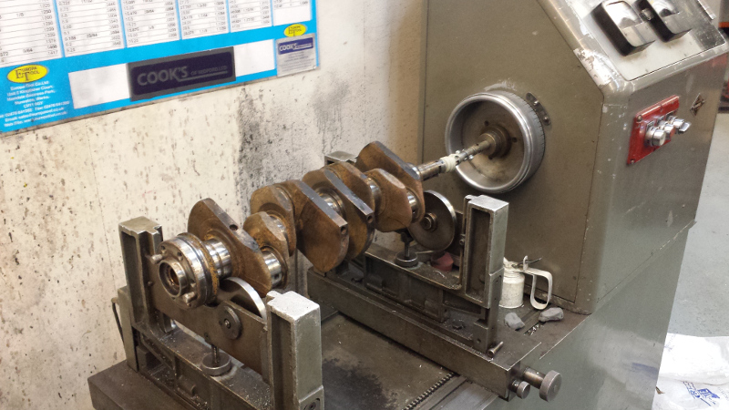
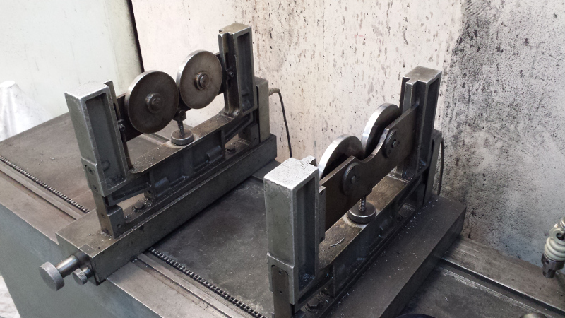
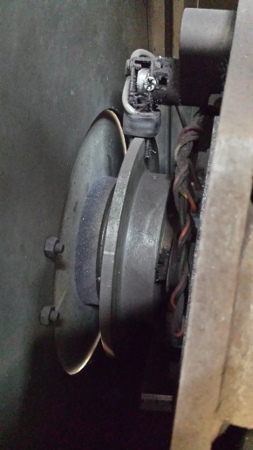
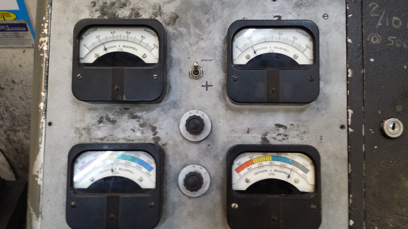

# Engine Balancer
Updating/Retro Fitting the sensors on an engine balancing machine...

## Balancer Description
An engine balancer is a simple electro-mechanical machine, that just happens to be blessed with a little magic for it to work.
Functional components consist of:
* Roller Assembly
* Crank Angle Sensor
* Drive Motor
* Instrumentation

### Roller Assembly
The roller assembly sit on a structure that is designed to act as a pendulum. The pendulum is trussed by two steel strips that restrict the movement. A Load Cell is fixed to the rear strap. The entire structure sits on a solid bed, and can be positioned to suit various shaft bearing widths.

When the crankshaft is spun by the drive motor any imbalances will cause the pendulum to exert a force on the Load Cell.

### Crank Angle Sensor
Once we have a notional force we need to give it context, for this we want the angle of the crank. This machine uses an aluminium disk with a steel grub screw to excite a variable reluctance sensor.

### Drive Motor
Its a big ugly 3-phase thing that will spin the shaft at a set speed, thankfully because it works perfectly well we don't have to worry about it.

### Instrumentation
Somehow due to magic (this thing originally used valves, and was transistorised in the 1980s) the forces read from the Load Cells are presented with their reference angles. There are some frightening looking boxes with wires, and a whole heap of calibration trim pots that defy description.

---

## Updating/Retro Fitting
### Roller Assembly
The physical structure of the Assembly will not need any substantial changes, but the Load Cell will be updated.

### Crank Angle Sensor
Three photo interrupters will be used with two slotted disks
- Two interrupters on a multi-slotted disk to provide angle and direction. (See 'Further Description, Including Encoder Waveform' section of [Arduino Playground -  Rotary Encoders](http://playground.arduino.cc/Main/RotaryEncoders) )
- One interrupter on a single slot disk to provide a synchronisation pulse, denoting 0 degree.

### Drive Motor
Its a terrifying thing, and is to be left alone.

### Instrumentation
The idea is to embrace the mantra 
> Perfect is the enemy of Good Enough

So I'm using things that already work, and a nice simple way of coding them.

Things that already work are:
* Arduino Mega 2560
    * [Robot Shop's Strain gauge load cell amplifier sheild](http://www.robotshop.com/uk/strain-gauge-load-cell-amplifier-shield-2ch.html?utm_source=Facebook&utm_medium=Paid&utm_campaign=ProdCatUK)
    * Opteck OPB830W Photo Interrupters (http://datasheet.octopart.com/OPB830W55Z-TT-datasheet-5310085.pdf)
* Python based Graphical display.